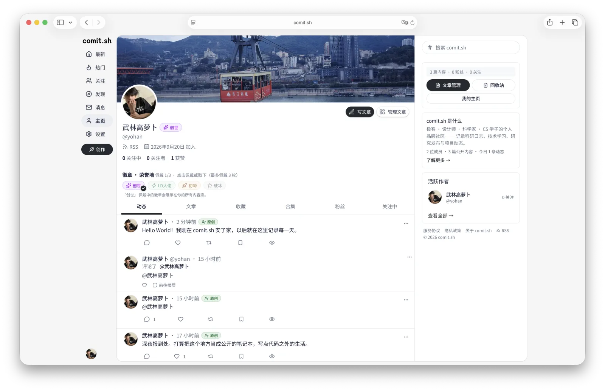

# comit.sh — Commit your ideas.

## 在线体验

**[https://comit.sh](https://comit.sh)** —— 官方演示环境跑的就是本仓库的代码，不必先部署：匿名可直接浏览，注册后即可体验从写作到分发的完整链路。

[](https://comit.sh)

| 入口 | 地址 | 可以体验什么 |
| --- | --- | --- |
| 社区时间线 | [comit.sh/feed](https://comit.sh/feed) | 长文与短动态混排、点赞/转发/收藏、@提及与评论线程 |
| 发现与热门 | [comit.sh/explore](https://comit.sh/explore) · [comit.sh/hot](https://comit.sh/hot) | 全站热门排序、作者发现；话题页 `/topics/{slug}` 随文章标签自动生成 |
| 长文排版 | 时间线内点进任意一篇 | GFM、KaTeX 公式、Shiki 高亮、Mermaid 图表、目录与阅读进度（演示站当前只有短动态，长文示例需发布后查看） |
| 作者主页 | [comit.sh/u/yohan](https://comit.sh/u/yohan)（即上图） | 个人主页、徽章荣誉墙、动态/文章/收藏/合集、订阅 RSS |
| 写作台 | [comit.sh/write](https://comit.sh/write)（需登录） | Markdown 实时预览、封面与图片管线、发布/定时与审核流转 |
| 内容分发 | [comit.sh/feed.xml](https://comit.sh/feed.xml) | 站点与作者两级 RSS，外加 `sitemap.xml` / `robots.txt` 与 Open Graph 元数据 |
| 机器接口 | `comit.sh/api/mcp`（Bearer 令牌） | 经 MCP 读写自己的内容，见 [docs/api.md](docs/api.md) 的 MCP 章节 |

演示站是**真实公开环境**：发帖、评论、上传都会进入审核并对外可见，请勿用于测试含个人信息的内容。
想跑自己的实例，见[快速开始](#快速开始)。

> 提交，是技术世界最古老的仪式——从 1956 年 MIT 主机上的 COMIT 语言，到你指尖的每一次 `git commit`。comit.sh 把这个仪式，变成你的个人主页。

comit.sh 是为技术极客、设计师、科学家与领域学子打造的个人主页社交网络：记录科研日志、技术学习过程、研究发布与项目动态。简历风味浓厚的学术与技术交流聚集地，拥抱 AI 的下一代个人品牌内容发布与运营平台。

**命名语源**：COMIT（1956, MIT，最早的字符串处理语言之一）× `git commit`（每个工程师的日常动作）× COMIT Network（Web3 开源跨链路由协议）× Datacom COMIT（大型机 Datacom 数据库的事务提交命令）——四个时代的「提交」，一个域名。

多用户写作与社交平台：深度 Markdown 排版、公式/图表渲染、独立子域名、RSS 分发、强制 2FA、LLM 内容审核、MCP 开放接口、插件化博客主题系统、角色与认证体系。

> ⚠️ 发布前请补充：首页社区时间线与个人主页的深色模式截图，同样存放于 `docs/assets/` 并在此引用。
> 系统设计与持续演进的完整文档见 [docs/](docs/README.md)（品牌 / 架构 / 并发 / 主题 / 权限 / 通知 / 运维 / API / 路线图）。

## 技术栈

| 层 | 选型 |
| --- | --- |
| 框架 | Next.js 16（App Router, RSC）+ React 19 + TypeScript strict |
| UI | Tailwind CSS v4（CSS 变量主题 Token）+ shadcn/ui 风格组件（Radix primitives） |
| ORM | Drizzle ORM + PostgreSQL（`drizzle-kit` 版本化 SQL 迁移） |
| 认证 | 自研会话（DB session + httpOnly cookie）+ otplib TOTP（强制 2FA）+ Passkey/WebAuthn + Arctic OAuth + Discourse SSO + Cloudflare Access |
| 邮件 | Nodemailer SMTP + 双语 HTML 模板 |
| 队列 | pg-boss（PostgreSQL 作业队列：邮件/Webhook 投递/审核/导出） |
| 内容管道 | unified（remark/rehype）+ GFM + KaTeX + Shiki + Mermaid + rehype-sanitize |
| 图片 | sharp → 全格式转 WebP（头像 512²、封面 1920w、正文 2000w） |
| 事件 | Emittery 类型化事件总线 + hookable 钩子 |
| MCP | @modelcontextprotocol/sdk（`/api/mcp`，Bearer token） |

## 架构（Laravel 风格的可扩展设计）

```
src/
├── core/                    # 框架层（"framework"）
│   ├── container.ts         # 服务容器 / 门面（app.db / app.events / app.queue ...）
│   ├── config.ts            # 配置仓库（env，生产密钥 fail-fast 校验）
│   ├── events.ts            # 类型化领域事件总线（AppEventPayloads）
│   ├── hooks.ts             # 全局钩子（action/filter，基于 hookable）
│   ├── http-client.ts       # 统一出站 HTTP（超时/重试/SSRF 守卫）
│   ├── queue.ts             # 队列门面（pg-boss）+ 类型化作业
│   ├── routes.ts            # 命名路由注册表
│   ├── errors.ts            # 应用异常 + HTTP 映射
│   ├── workers.ts           # 队列 worker 注册（instrumentation 启动）
│   └── plugins/             # 插件/扩展点契约 + 注册表
├── extensions/              # 内置功能全部以扩展形式实现（验证扩展点）
│   ├── notifications/       # 多频道通知（database / mail / webhook，可扩展）
│   ├── webhooks/            # 用户事件订阅 + HMAC 签名投递（SSRF 双防线）
│   ├── moderation/          # 关键词黑名单 + LLM 审核流水线
│   ├── mcp/                 # MCP 工具集（文章/媒体/信息流…）
│   ├── export/              # Markdown+媒体 ZIP 全量导出
│   └── badges/ poll/ share/ signature/ …
├── db/                      # Drizzle schema / 迁移入口 / 种子
├── lib/                     # 领域服务（auth / media / markdown / settings / i18n / seo …）
├── components/              # UI（shadcn 风格 + 业务组件）
├── app/                     # 路由（页面 + API）
└── instrumentation.ts       # 进程启动引导（扩展 boot、worker 注册）
```

**扩展点**：扩展可注册通知频道、MCP 工具、侧边栏组件、管理面板区块、渲染钩子（`post:render`）、队列作业。领域事件（`post:published`、`comment:created`…）是所有副作用（通知/Webhook/审核）的唯一触发源。扩展点开发指南见 [docs/extensions.md](docs/extensions.md)。

## 快速开始

### 前置依赖

| 依赖 | 版本 | 说明 |
| --- | --- | --- |
| Node.js | **24.x**（生产镜像用 `node:24-alpine`；≥20.19 亦可运行） | [nvm](https://github.com/nvm-sh/nvm) / [fnm](https://github.com/Schniz/fnm) 管理 |
| pnpm | 12.x | 项目用 corepack：`corepack enable && corepack install` 即自动锁定 `pnpm@12.3.4` |
| Docker | 20.10+ | 仅用于本地起 PostgreSQL + Mailpit（也可用自备 PG） |

### 启动

```bash
git clone https://github.com/Travisun/comit.git && cd comit
corepack enable                      # 启用 pnpm（若未装）
docker compose up -d                 # PostgreSQL(:5433, 仅回环) + Mailpit(:8025 收信 UI, 仅回环)
pnpm install                         # 依赖安装（pnpm 自动应用 patches/ 下的 next 补丁）
cp .env.example .env                 # 默认值即为本地可用值，开箱即用
pnpm db:migrate                      # 应用数据库迁移
pnpm db:seed                         # 管理员 + 演示数据（仅本地开发！见下）
pnpm dev                             # http://localhost:3000
```

- 种子管理员 `admin@myblogs.local` 的口令来自 `ADMIN_PASSWORD` / `SEED_ADMIN_PASSWORD` 环境变量；交互式开发未提供时随机生成一次性口令并打印在终端。**生产环境禁止 `db:seed`**（脚本会硬性拒绝）。
- 演示用户/内容（alice、bob 等）仅在你显式 `pnpm db:seed --demo` 时创建。
- 开发邮件全部落在 Mailpit：http://localhost:8025（注册验证、找回密码、通知邮件都在那里）。
- 子域名模式本地测试：`lvh.me:3000` / `alice.lvh.me:3000`（或 hosts 里加 `*.localhost`）。
- 第三方登录 / LLM 审核 / R2 存储均为可选项：不配置对应 env 时功能自动隐藏，核心写作/社交链路不依赖它们。

### 常用脚本

| 命令 | 作用 |
| --- | --- |
| `pnpm dev` / `pnpm build` / `pnpm start` | 开发 / 构建 / 单进程生产启动 |
| `pnpm start:cluster` | 生产集群：按核数 fork 多 worker（`WEB_CONCURRENCY` 控制） |
| `pnpm test` | vitest 全量测试 |
| `pnpm lint` | ESLint（提交前的质量门禁之一） |
| `pnpm db:generate` | schema 变更后生成 SQL 迁移 |
| `pnpm db:migrate` / `db:studio` / `db:seed` | 应用迁移 / Drizzle Studio / 幂等种子 |
| `pnpm ext` | 扩展脚手架脚本（`scripts/ext.ts`） |

## 部署

> 生产形态的完整步骤（Compose 全容器 / 宝塔反代复用宿主机 PG+Redis / 裸进程集群）见 [docs/deploy-baota.md](docs/deploy-baota.md) 与 [docs/concurrency.md](docs/concurrency.md)；启动前必读 [SECURITY.md](SECURITY.md) 的硬性要求。

| 场景 | 方式 |
| --- | --- |
| 单机全容器（PG/Redis 一起容器化） | `docker compose -f docker-compose.prod.yml up -d --build` |
| 宿主机已有 PG/Redis + 宝塔 nginx 反代 | 见 [docs/deploy-baota.md](docs/deploy-baota.md)（`docker-compose.server.yml`，app 只绑 `127.0.0.1:3000`） |
| 裸进程集群（多 worker + 队列竞争消费） | `pnpm build && WEB_CONCURRENCY=4 pnpm start:cluster`，细节见 [docs/concurrency.md](docs/concurrency.md) |

**部署安全硬性要求**（不完整列表见 [SECURITY.md](SECURITY.md)）：

1. 应用端口只绑回环，公网流量必须经 nginx/CDN 反代——否则按 IP 限流可被伪造头绕过；
2. `TRUST_PROXY` 与真实拓扑一致（直连 = `direct`）；
3. 生产强制 HTTPS + 随机 `AUTH_SECRET`（≥32 字符，启动时 fail-fast 校验）；
4. 媒体存储 `storage/` 与 `.env` 不入 git、不由 Web 直出。

## 环境变量

完整注释版见 [.env.example](.env.example)（本地）与 [.env.server.example](.env.server.example)（服务器形态）。核心项：

| 变量 | 必填 | 说明 |
| --- | --- | --- |
| `APP_URL` / `ROOT_DOMAIN` | ✅ | 站点 URL 与用户子域名根域 |
| `AUTH_SECRET` | ✅ | 会话/JWT 签名密钥；生产 ≥32 字符随机值 |
| `DATABASE_URL` | ✅ | PostgreSQL 连接串 |
| `REDIS_URL` | — | 限流一级驱动；缺省降级 PG/内存桶 |
| `TRUST_PROXY` | — | `direct` / `nginx` / `cloudflare`，须与真实拓扑一致 |
| `SMTP_HOST` `SMTP_PORT` `SMTP_USER` `SMTP_PASS` `MAIL_FROM` | ✅* | 邮件投递（无 SMTP 则注册/找回不可用） |
| `GITHUB_/GOOGLE_/X_/LINUXDO_CLIENT_ID+SECRET` | — | 第三方登录（后台也可配置，env 优先引导） |
| `DISCOURSE_SSO_URL` `DISCOURSE_SSO_SECRET` | — | Discourse SSO（URL 必须 https） |
| `CF_ACCESS_TEAM` `CF_ACCESS_AUD` | — | Cloudflare Access 登录；**AUD 必填**，留空该方式自动禁用 |
| `STORAGE_DRIVER` `R2_*` | — | 媒体驱动 `local` / `r2`（Cloudflare R2 / S3 兼容） |
| `WEB_CONCURRENCY` `PGPOOL_MAX` `QUEUE_CONCURRENCY` | — | 集群与队列并发 |
| `LLM_ALLOW_INTERNAL_BASEURL` | — | 仅本机推理服务（Ollama 等）置 1，否则 LLM 出站过 SSRF 守卫 |

## 关键产品能力

- 多用户/单用户双模式（后台切换，单用户模式下首页即博主主页）
- 文章 + 短动态（无标题图文流）；合集（分类）与话题（每文 ≤5）；投票/PK 组件
- Markdown 深度渲染：GFM、KaTeX 公式、Shiki 代码高亮、Mermaid 图表/思维导图、净化后的受限 HTML
- 编辑器：粘贴/拖拽图片自动上传转 WebP、工具栏、实时预览、⌘S 保存
- 审核：关键词硬拦截（提交前提示）→ LLM 审核或人工审核 → 发布/驳回（含通知邮件）
- 社交：关注/拉黑、点赞、评论、转发、互关私信（图片私信）、徽章系统
- 强制 2FA（TOTP + 恢复码）、Passkey/WebAuthn、邮箱验证、找回密码、GitHub/Google/X/Linux.do/Discourse/Cloudflare 登录自动注册
- 邀请码注册（自动关注邀请人）、用户子域名（可锁定）、RSS/Atom（主站/用户/子域名）
- Webhook 订阅（HMAC-SHA256 签名重试投递）、MCP 令牌管理内容
- GDPR：全量导出 ZIP（Markdown + 按日期归档媒体）、账户删除（内容匿名化或彻底删除）
- SEO：metadata/OG/JSON-LD、sitemap/robots；外链 nofollow + 新窗口 + 离站确认

## 安全模型（摘要）

本仓库发布前经过一轮系统安全审计，要点：

- **认证**：DB 会话 + httpOnly/SameSite cookie，登出/改密/重置即服务端吊销；scrypt 密码哈希 + 时序补偿；OAuth state/nonce/PKCE；2FA 按「IP + 账户」双维限流，TOTP 原子防重放
- **授权**：全部管理路由 withAdmin/withPermission 前置守卫；对象级归属校验（帖子/合集/私信/令牌均在 WHERE 绑定 userId）；三级限流桶（Redis→PG→内存）后台可覆写
- **内容**：全站唯一服务端净化管线（rehype-sanitize 收紧 schema + style 值级收紧 + KaTeX `trust:false` + mermaid `securityLevel:strict`）；扩展注入 HTML 与净化后改写通道均强制复净
- **出站**：统一 http-client 带 IPv4/IPv6 SSRF 守卫（云 metadata/私网/保留段，逐跳复检）；LLM/webhook 默认过守卫
- **文件**：上传 MIME 白名单 + sharp 归一 WebP + 服务端 nanoid 命名 + 恒定 `Content-Type: image/webp`；本地存储驱动做 storage-root 包含校验

安全响应头（CSP/XFO/nosniff/Referrer-Policy/Permissions-Policy/HSTS）由 `next.config.ts` 与 `src/proxy.ts` 统一下发：CSP 的 `script-src` 为 `'self' 'nonce-…' 'strict-dynamic'`，生产环境不含 `unsafe-inline`/`unsafe-eval`（后者仅 dev）。漏洞响应与已知边界见 [SECURITY.md](SECURITY.md)。

## 文档索引

[docs/README.md](docs/README.md) 是完整路标：architecture / concurrency / schema / api / extensions / theme-system / roles-permissions / notifications / operations / admin-guide / brand / roadmap 等 20+ 篇。

## 贡献

- Fork 本仓库 + 分支开发；提交前跑 `pnpm lint && pnpm test && pnpm build`（三者全绿是合并前提）
- 迁移用 `pnpm db:generate` 生成，勿手改 `drizzle/` 产物
- `patches/` 存放依赖补丁（由 pnpm 的 `patchedDependencies` 声明并自动应用）；升级 `next` 时需同步复核补丁
- 大特性先开 Issue 讨论；安全类问题**不要**开公开 Issue，走 [SECURITY.md](SECURITY.md)

## 许可证与免责声明

本项目基于 [MIT License](LICENSE) 开源。

**请务必阅读**：这是一个仍在演进中的个人项目，虽经系统性安全审计，但**不能保证不存在未被发现的安全漏洞或缺陷**。MIT 协议第五条以「原样（AS IS）」提供本软件、不作任何担保并把风险全部转移给使用者——凡将本项目部署到公网、存储真实用户数据或用于任何生产用途，即视为你已充分理解并接受：需自行完成部署加固（HTTPS、反向代理、防火墙、备份、监控）、自行评估所在司法辖区的合规义务（个人信息保护、内容审查等），并独自承担因使用或无法使用本软件产生的全部后果。强烈建议在对公网开放前，将本仓库完整交给你的安全团队或审计工具再做一轮评审。
